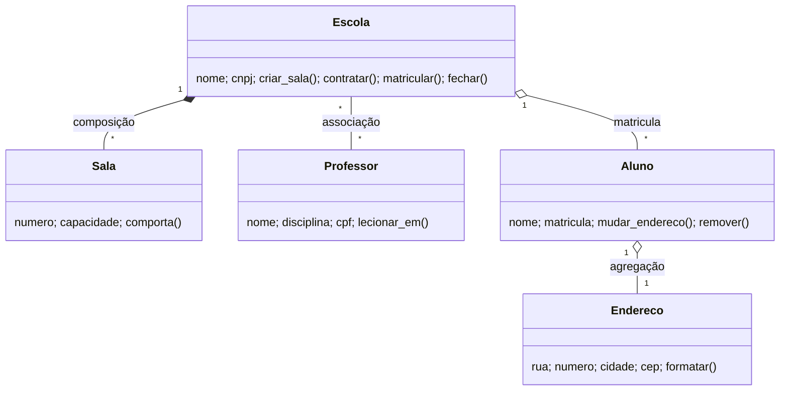

# TP01 — Escola

Código: [`escola.py`](escola.py) (rode `python escola.py`, tem asserts de verificação).

## 1. Entidades

| Classe | Atributos | Métodos |
|---|---|---|
| Escola | nome, cnpj, salas, professores, alunos | criar_sala(), contratar(), matricular(), fechar() |
| Sala | numero, capacidade | comporta() |
| Professor | nome, disciplina, cpf, escolas | lecionar_em() |
| Aluno | nome, matricula, endereco | mudar_endereco(), remover() |
| Endereco | rua, numero, cidade, cep | formatar() |

## 2. Relações

| Relação | Tipo | Justificativa |
|---|---|---|
| Escola — Sala | **Composição** | Sala só existe dentro da escola; a escola a cria e, se fechar, as salas deixam de existir (ciclo de vida preso, "todo" exclusivo). |
| Professor — Escola | **Associação** (N:N) | Ambos existem sozinhos; um professor leciona em várias escolas e vice-versa. Nenhum é "parte" do outro. |
| Aluno — Endereço | **Agregação** | O endereço nasce com o aluno, mas ao remover o aluno ele continua fazendo sentido (relatórios) e é repassado a outro contexto, ou seja, existência independente do "todo". |

## 3. Diagrama UML

