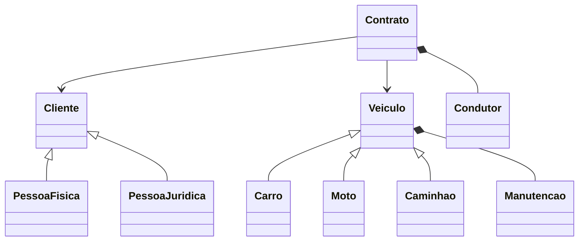

# TP02 — Locadora de Veículos

Código: [`locadora.py`](locadora.py) (rode `python locadora.py`, tem asserts de verificação).

## 1. Classes
Veiculo (Carro, Moto, Caminhao), Cliente (PessoaFisica, PessoaJuridica), Contrato, Condutor, Manutencao.

## 2. Atributos e métodos

| Classe | Atributos | Métodos |
|---|---|---|
| Veiculo | placa, modelo, ano, valor_diaria | calcular_aluguel(), registrar_manutencao(), taxa_extra() |
| Carro / Moto | (herdados) | taxa_extra() |
| Caminhao | + capacidade_kg | taxa_extra() |
| Cliente | nome, documento, telefone | contato(), tipo_documento() |
| PessoaFisica / PessoaJuridica | (herdados) | tipo_documento() (CPF / CNPJ) |
| Contrato | inicio, fim_previsto, valor_total, status | finalizar(), cancelar() |
| Condutor | nome, cnh | habilitado() |
| Manutencao | data, tipo, custo | resumo() |

## 3. Herança
- **Veiculo** (superclasse abstrata) → Carro, Moto, Caminhao: compartilham placa/modelo/ano/diária; cada tipo calcula `taxa_extra()` de forma própria (polimorfismo).
- **Cliente** (superclasse abstrata) → PessoaFisica, PessoaJuridica: mesmos campos, mudando o tipo de documento (CPF/CNPJ).

## 4. Relacionamentos

| Par | Tipo | Justificativa |
|---|---|---|
| Contrato — Cliente | Associação | Todo contrato tem 1 cliente, mas o cliente existe sem contrato. |
| Contrato — Veiculo | Associação | Contrato referencia 1 veículo; veículo é independente (só 1 contrato ativo por vez). |
| Contrato — Condutor | **Composição** | Condutor só existe no contrato; excluído o contrato, o condutor some. |
| Veiculo — Manutencao | **Composição** | Cada manutenção pertence a um único veículo e é criada por ele. |

## 5. Implementação parcial
Contrato ◆— Condutor (o `Contrato` instancia o `Condutor` no `__init__`) e Veiculo ◆— Manutencao (`registrar_manutencao()` instancia a `Manutencao`). Ver `locadora.py`.

