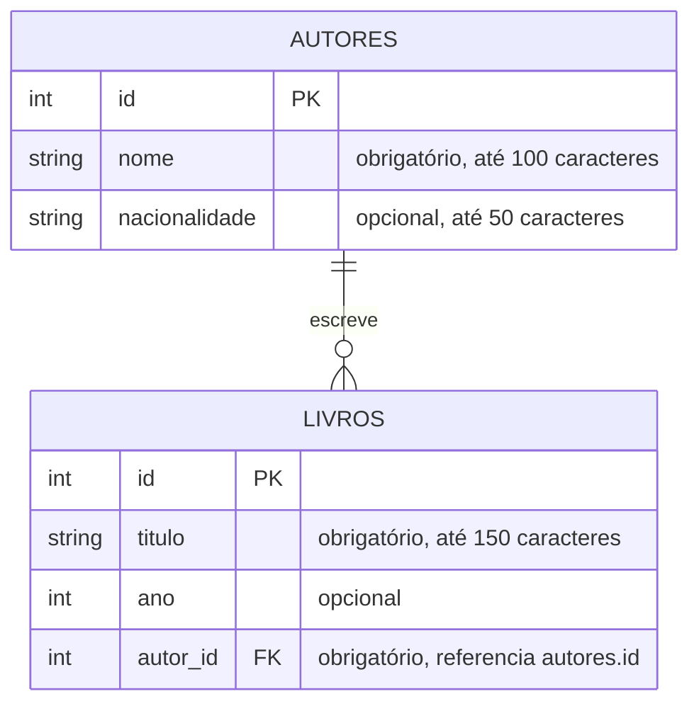

# TP03 — API da Biblioteca

API REST feita com **FastAPI**, **SQLAlchemy** e **Alembic** para o TP03 de Arquitetura de Software.

## Modelo de negócio

A API controla o acervo de uma **biblioteca**. Ela tem dois recursos:

- **Autor**: a pessoa que escreveu os livros. Tem um nome (obrigatório) e uma nacionalidade (opcional).
- **Livro**: uma obra do acervo. Tem um título (obrigatório), um ano de publicação (opcional) e pertence a exatamente um autor.

Um autor pode ter vários livros, e cada livro tem um único autor (relação **1:N**).

Regras de negócio:

- Um livro só pode ser cadastrado para um autor que já existe. Se o `autor_id` não existir, a API responde **404**.
- Um autor que ainda tem livros não pode ser apagado. A API responde **409** em vez de apagar os livros em silêncio.

## Entidades e relacionamento



- Tabela `autores`: model `Autor` (`app/models/autor.py`).
- Tabela `livros`: model `Livro` (`app/models/livro.py`). A coluna `autor_id` é uma `ForeignKey` para `autores.id`.
- No código, `autor.livros` devolve a lista de livros do autor e `livro.autor` devolve o autor do livro (`relationship()` nos dois lados).

## Estrutura do projeto

```
tp03-api/
├── app/
│   ├── main.py            # cria o app e registra os routers
│   ├── core/database.py   # engine, sessão, Base e get_db
│   ├── models/            # tabelas (SQLAlchemy)
│   ├── schemas/           # entrada e saída da API (Pydantic)
│   └── routers/           # endpoints de /autores e /livros
├── alembic/               # migrações versionadas do banco
├── alembic.ini
└── requirements.txt
```

## Como rodar

Pré-requisitos: **Python 3.10 ou mais novo** e **git**.

1. Clone o repositório e entre na pasta do TP03:

   ```bash
   git clone https://github.com/Mystic0112/arquitetura-software-trabalhos.git
   cd arquitetura-software-trabalhos/tp03-api
   ```

2. Crie e ative um ambiente virtual:

   ```bash
   python -m venv .venv
   source .venv/bin/activate        # Windows: .venv\Scripts\activate
   ```

3. Instale as dependências:

   ```bash
   pip install -r requirements.txt
   ```

4. Crie o banco com as migrações do Alembic. Este comando gera o arquivo `biblioteca.db` (SQLite) com as tabelas `autores` e `livros`:

   ```bash
   alembic upgrade head
   ```

5. Suba a API:

   ```bash
   uvicorn app.main:app --reload
   ```

6. Abra a documentação interativa (Swagger) em <http://localhost:8000/docs>.

> As tabelas são criadas **somente** pelo Alembic. Se a API responder erro de tabela inexistente, rode o passo 4.

Se você mudar um model, gere e aplique uma nova migração:

```bash
alembic revision --autogenerate -m "descrição da mudança"
alembic upgrade head
```

## Endpoints

### Autores (`/autores`)

| Método | Rota | Descrição | Respostas |
|---|---|---|---|
| POST | `/autores/` | Cria um autor | 201, 422 |
| GET | `/autores/` | Lista todos os autores | 200 |
| GET | `/autores/{autor_id}` | Busca um autor pelo id | 200, 404 |
| PATCH | `/autores/{autor_id}` | Atualiza só os campos enviados | 200, 404, 422 |
| DELETE | `/autores/{autor_id}` | Remove um autor (recusa se ele tiver livros) | 204, 404, 409 |

### Livros (`/livros`)

| Método | Rota | Descrição | Respostas |
|---|---|---|---|
| POST | `/livros/` | Cria um livro. Valida se o `autor_id` existe | 201, 404, 422 |
| GET | `/livros/` | Lista todos os livros. Filtro opcional `?autor_id=` | 200 |
| GET | `/livros/{livro_id}` | Busca um livro pelo id | 200, 404 |
| PATCH | `/livros/{livro_id}` | Atualiza só os campos enviados. Valida o novo `autor_id` | 200, 404, 422 |
| DELETE | `/livros/{livro_id}` | Remove um livro | 204, 404 |

### Códigos de resposta

| Código | Quando acontece |
|---|---|
| 200 | Consulta ou atualização feita |
| 201 | Recurso criado |
| 204 | Recurso removido (sem corpo na resposta) |
| 404 | O id não existe, ou o `autor_id` de um livro aponta para um autor que não existe |
| 409 | Tentativa de apagar um autor que ainda tem livros |
| 422 | Corpo inválido: campo obrigatório faltando ou tipo errado (validação do Pydantic) |

### Exemplos de corpo

Criar autor (`POST /autores/`):

```json
{ "nome": "Machado de Assis", "nacionalidade": "Brasileira" }
```

Criar livro (`POST /livros/`):

```json
{ "titulo": "Dom Casmurro", "ano": 1899, "autor_id": 1 }
```

Atualizar só o ano de um livro (`PATCH /livros/1`):

```json
{ "ano": 1900 }
```

## Equipe

| Integrante | Parte |
|---|---|
| Hélio | Base do projeto: banco, models, Alembic e migração, `main.py` |
| Augusto | Recurso Autor: schemas e router |
| Yan | Recurso Livro: schemas e router com validação de FK; README e roteiro da apresentação |
